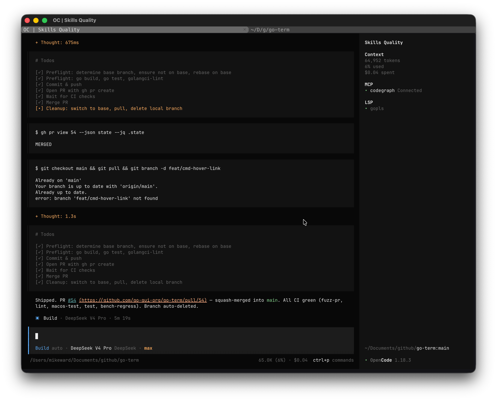

#  Falcon

Falcon is a full-featured terminal emulator built on
[`go-term`](../../) and the [`go-gui`](https://github.com/go-gui-org/go-gui)
framework. It spawns a real shell over a PTY and renders through a
GPU-accelerated `gui.DrawCanvas`, covering the protocol surface expected by
modern CLI tools and TUI frameworks (vim, less, htop, tmux).

It is both the reference embedder for `term/workspace` — multi-tab,
multi-pane, save/restore, config-file driven — and a daily-driver terminal on
macOS. Targets macOS, Linux, and Windows (ConPTY).



## Install

Prebuilt binaries attach to each [go-term release](https://github.com/go-gui-org/go-term/releases):
a macOS DMG, a Linux tarball, and a Windows zip.

### macOS

```sh
brew install go-gui-org/tap/falcon
```

Until Falcon is Developer ID signed and notarized, Gatekeeper blocks the
first launch: right-click the app in Finder and choose Open. Releases are
ad-hoc signed.

### Linux

Download `falcon-<version>-linux-amd64.tar.gz` from the release page — it
contains the binary, a `.desktop` entry, the icon, and install instructions
(`packaging/install.txt` in the repo). Requires SDL2, FreeType, HarfBuzz,
Pango, fontconfig, and GLib at runtime.

### Windows

Download `falcon-<version>-windows-amd64.zip` from the release page and
unzip it anywhere. No runtime dependencies beyond a stock Windows 10/11.

## Run from the source tree

```bash
cd examples/falcon
go run .
```

Build a versioned binary from the repo root (stamps `git describe --tags` into
the About dialog; excludes the go-gui F12 inspector):

```bash
make build-falcon    # ./falcon
```

Or install it:

```bash
go install github.com/go-gui-org/go-term/examples/falcon@latest
```

A `go install` build has no linker-stamped tag, so the About dialog falls back
to the module version, then the embedded VCS revision, then `dev`.

### macOS `.app` bundle

```bash
make app          # → Falcon.app, using examples/falcon/icon/falcon.icns
make clean-app
```

Bundling builds the `buildapp` tool from the go-gui module in `go.mod` — no
sibling checkout needed. Icon sources and regeneration steps live in
[`icon/README.md`](icon/README.md).

By default the bundle is signed ad-hoc, which macOS keys permission grants
against by content hash. The hash changes on every build, so each `make app`
silently revokes Screen Recording, microphone, camera and accessibility
access — System Settings still lists the app as granted while the API returns
denied. Sign with a stable identity to keep grants across rebuilds:

```bash
make app SIGN_IDENTITY="My Dev Cert"
```

A self-signed code-signing certificate from Keychain Access is enough; no
Apple Developer account is needed. A universal
`BUILDAPP_SIGN_IDENTITY` variable applies it to every build without passing
`SIGN_IDENTITY`. See
[`buildapp`'s README](https://github.com/go-gui-org/go-gui/tree/main/cmd/buildapp#signing).

## Command-line flags

| Flag                        | Default                              | Meaning                                                  |
| --------------------------- | ------------------------------------ | -------------------------------------------------------- |
| `--workspace <path>`        | default path, if it exists           | Workspace JSON to restore on startup                     |
| `--save-workspace <path>`   | `--workspace`, else the default path | Workspace JSON to write on quit                          |
| `--record <path.gtr>`       | off                                  | Record the starting pane's session                       |
| `--replay <path.gtr>`       | off                                  | Play back a recording instead of starting a shell        |
| `--replay-speed <n>`        | `1`                                  | Playback speed multiplier                                |
| `--replay-idle-limit <dur>` | `0` (no cap)                         | Cap any single gap between recorded frames, e.g. `250ms` |
| `--replay-loop`             | off                                  | Restart playback at the end of the recording             |

`--replay` is a viewer path, not a multiplexer: one pane, no tabs, no shell,
no workspace persistence.

## Workspace persistence

Falcon saves its tab/pane layout on quit and restores it on the next launch,
with no flags needed. The default file is `workspace.json` in the go-term
config directory (`workspace.DefaultWorkspacePath()`).

- Restore falls back to a fresh workspace on a missing, unparseable, or
  version-mismatched file — a bad workspace file never blocks startup.
- Saving happens on both quit paths: the close request (Cmd+Q, window close)
  and the last shell exiting.
- With live shells open, quitting asks for confirmation first
  (`confirmOnQuit` in `window.go`).
- New tabs and splits inherit the focused pane's working directory.

Point `--workspace` and `--save-workspace` at different files to keep a
read-only "template" layout that startup restores but quit never overwrites.

## Configuration

Falcon reads the shared go-term config file — an INI at
`~/.config/go-term/config` (or `$XDG_CONFIG_HOME`/`os.UserConfigDir()`),
parsed by `term/workspace`, not by falcon itself.

```ini
[font]
family = JetBrainsMono NFM
size   = 13

[general]
theme      = Tokyo Night
scrollback = 20000
bell       = auto
scrollbar  = 4

[keybindings]
workspace.splitVertical = Cmd+D
term.find               = Cmd+G
term.scroll-page-up     = none    # hand PageUp back to the child process
```

- `Cmd+,` opens the config file in the OS-default editor, writing a commented
  stub first if it doesn't exist. This binding belongs to falcon, not to the
  library, and is not rebindable.
- `Cmd+Shift+,` reloads the file into every open pane without restarting.

Every section, key, default, and rebindable action is documented in
[`docs/config.md`](../../docs/config.md).

### Themes

Falcon registers fourteen built-in themes (`themeList()` in `config.go`):
Default, Dracula, Catppuccin Mocha, Tokyo Night, Monokai, One Dark, Rosé Pine,
Kanagawa, Ayu Dark, Everforest, GitHub Dark, Gruvbox, Nord, Solarized Dark.
Pick one live with `Cmd+Shift+T`, or set `[general] theme` in the config.

### Font

The default is `JetBrainsMono NFM` at 12pt. The family must be spelled as the
font's own name table spells it — go-glyph's pure-Go discovery reads that
table, where JetBrains Mono Nerd Font Mono appears as `JetBrainsMono NFM`, not
the marketing name. If the font isn't installed, set `[font] family` to
something that is (e.g. `Menlo`).

## Keyboard shortcuts

`Cmd+/` opens the in-app help overlay, which is generated from the live
binding table — it is always accurate for your config. Highlights:

| Chord                                         | Action                                                       |
| --------------------------------------------- | ------------------------------------------------------------ |
| `Cmd+D` / `Cmd+Shift+D`                       | Split vertically / horizontally                              |
| `Cmd+[` / `Cmd+]`                             | Previous / next pane                                         |
| `Cmd+Ctrl+←↑↓→`                               | Resize the split                                             |
| `Cmd+T` / `Cmd+Shift+W` / `Cmd+Ctrl+W`        | New tab / close pane / close tab                             |
| `Cmd+1`…`Cmd+9`, `Cmd+Shift+[` / `]`          | Select tab, previous / next tab                              |
| `Cmd+C` / `Cmd+V`                             | Copy / paste (`Ctrl+Shift+C/V` also)                         |
| `Cmd+F`                                       | Find, with `Ctrl+R` for regex                                |
| `Cmd+Shift+Space`                             | Copy mode — vim-keyed selection, output frozen               |
| `Cmd+↑` / `Cmd+↓` / `Cmd+Shift+E`             | Previous / next prompt, jump to last failure (needs OSC 133) |
| `Cmd+=` / `Cmd+-` / `Cmd+0`                   | Font zoom in / out / reset                                   |
| `Cmd+Shift+T` / `Cmd+Shift+I` / `Cmd+Shift+R` | Theme picker / broadcast input / toggle recording            |
| `Cmd+,` / `Cmd+Shift+,`                       | Open config / reload config                                  |

On Windows the Super key is OS-reserved, so `Cmd`-based defaults are remapped
(`Cmd`→`Ctrl+Shift`, `Cmd+Shift`→`Ctrl+Alt`, …). Chords written in the config
file are used verbatim.

Prompt navigation, failure jumping, and output selection depend on your shell
emitting OSC 133 semantic marks (`bash-preexec`, or the zsh/fish
shell-integration snippets).

## Recording and replay

Sessions record to `.gtr` files that store the PTY's bytes verbatim, so
malformed output survives the round trip. Keystrokes are captured only when
explicitly enabled (`Cfg.RecordInput`, off in falcon).

```bash
falcon --record session.gtr    # or Cmd+Shift+R to toggle on the focused pane
falcon --replay session.gtr    # space pauses, +/- speed, . steps, 0 restarts
```

`Cmd+Shift+R` recordings land in the `recordings` subdirectory of the go-term
config directory. Inspect and convert them with the `gotermrec` CLI:

```bash
go run ../../term/gotermrec info   session.gtr
go run ../../term/gotermrec play   session.gtr
go run ../../term/gotermrec export session.gtr -cast session.cast   # asciicast v2
```

This is the preferred way to file a rendering bug: a recording reproduces the
problem instead of describing it.

## File transfers

OSC 1337 `File=` transfers are saved to `~/Downloads`, matching iTerm2.
Downloads are opt-in per embedder (`workspace.Cfg.DownloadDir`), so this is
falcon's policy, not the library's; transfers are disabled entirely when the
home directory can't be resolved.

## Source map

| File               | Holds                                                                                    |
| ------------------ | ---------------------------------------------------------------------------------------- |
| `main.go`          | Flag parsing, app/window construction, exit-code plumbing                                |
| `config.go`        | CLI config structs, workspace path resolution, font, theme list, download dir            |
| `window.go`        | `app` struct, workspace create/restore, quit confirmation, save-and-close, replay window |
| `menu.go`          | Native menubar, About dialog, `Cmd+,` config command, config stub                        |
| `version.go`       | Version resolution: linker stamp → module version → VCS revision → `dev`                 |
| `icon.go`, `icon/` | Embedded window/Dock icon and platform icon assets                                       |

Design notes worth knowing before editing:

- `main` is a thin wrapper around `run()` because `os.Exit` and `log.Fatal`
  skip deferred teardown; the exit code comes back as a return value.
- `OnInit` cannot return an error and must not `log.Fatal`, so a fatal init
  failure is stashed in `app.initErr` and reported after the app loop unwinds.
- Quit confirmation uses go-gui's in-app dialog, not `NativeConfirmDialog`:
  the native `NSAlert` modal loses keyboard focus under the Metal backend's
  manual event pump.
- The About dialog is falcon's own, not `NSAboutPanel`, which reads from a
  bundle `Info.plist` that a `go run` binary doesn't have.
- There is no Edit menu — an auto-wired one would swallow `Cmd+C`/`Cmd+V`
  before go-term's binding table sees them.

## Tests

```bash
go test ./examples/falcon
```

The tests cover the parts that don't need a window: flag parsing and path
resolution (`config_test.go`), menubar config fields (`menu_test.go`), version
resolution (`version_test.go`), and the window/replay configs
(`window_test.go`). Anything that opens a real window still has to be checked
by running the app — try `ls`, `cat`, ANSI color output, window resize,
selection and copy, and a full-screen app such as `vim` or `less`.
